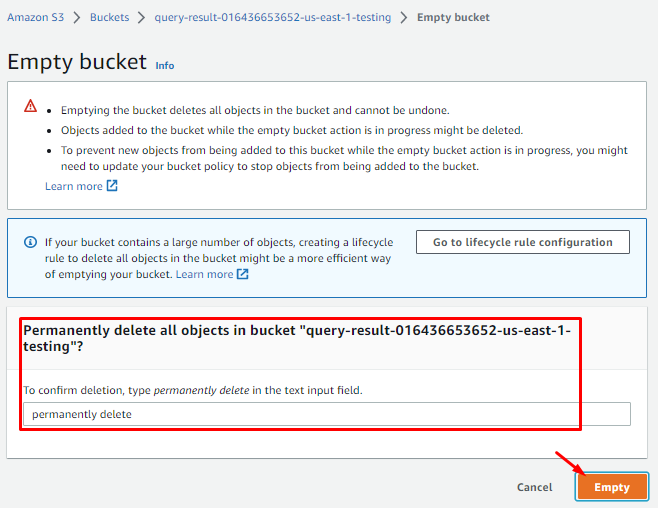

# AWS Athena Glue S3 CloudFormation Deployment Through AWSConsole

## Description
AWS Athena, Glue Database, Glue Crawler and S3 buckets deployment through CloudFormation stack on AWS console.

## Overview
This document provides detail on a CloudFormation template that can be deployed on your AWS environment. The template defines an IAM Role for Glue, two S3 buckets, Athena Workgroup, Glue Database, and a Glue Crawler which scans your S3 bucket and populates the Glue Database tables with the recordings metadata. Athena is used for querying the populated data.

## Step - 1
Open visual studio code and create a YAML file with any specific name and paste the CloudFormation stack code into that file and save.

``` yaml
# Sample CF YAML to demonstrate creating S3 buckets with Glue Database.
AWSTemplateFormatVersion: '2010-09-09'

# Parameters section contains name of the resource for your environment like staging, testing, production.
Parameters:
  Env:
    Type: String

# Resources section defines metadata for the Resources.
# Create IAM Role assumed by the crawler. For demonstration, this role is given all permissions.
Resources:
   AWSAthenaGlueRole:
     Type: AWS::IAM::Role
     Properties:
       AssumeRolePolicyDocument:
         Version: "2012-10-17"
         Statement:
           - Effect: "Allow"
             Principal:
               Service:
                 - "glue.amazonaws.com"
             Action:
               - "sts:AssumeRole"
       Path: "/"
       Policies:
         - PolicyName: AWSAthenaAccess
           PolicyDocument:
             Statement:
               - Effect: Allow
                 Action: athena:*
                 Resource: '*'
         - PolicyName: GlueS3Access
           PolicyDocument:
             Statement:
               - Effect: Allow
                 Action:
                   - glue:*
                   - iam:ListRolePolicies
                   - iam:GetRole
                   - iam:GetRolePolicy
                 Resource: '*'
               - Effect: Allow
                 Action:
                   - s3:*
                   - s3-object-lambda:*
                 Resource: '*'
               - Effect: Allow
                 Action:
                   - s3:GetObject
                   - s3:PutObject
                 Resource:
                   - arn:aws:s3:::aws-glue-*/*
                   - arn:aws:s3:::*/*aws-glue-*/*
                   - arn:aws:s3:::aws-glue-*
           PolicyName: AWSCloudWatchLogsAccess
           PolicyDocument:
             Statement:
               - Effect: Allow
                 Action:
                   - logs:CreateLogGroup
                   - logs:CreateLogStream
                   - logs:GetLogEvents
                   - logs:PutlogEvents
                 Resource:
                   - arn:aws:logs:*:*:/aws-glue/*

# Create a S3 bucket for raw data.
  RawDataBucket:
    Type: AWS::S3::Bucket
    Properties: 
      BucketName: !Sub raw-data-${AWS::AccountId}-${AWS::Region}-${Env}
      BucketEncryption: 
          ServerSideEncryptionConfiguration: 
            - 
              ServerSideEncryptionByDefault: 
                  SSEAlgorithm: 'AES256'
              BucketKeyEnabled: false
      PublicAccessBlockConfiguration:
        BlockPublicAcls: true
        BlockPublicPolicy: true
        IgnorePublicAcls: true
        RestrictPublicBuckets: true

# Create a S3 bucket for query data backup.
  AthenaQueryResultBucket:
    Type: AWS::S3::Bucket
    Properties: 
      BucketName: !Sub query-result-${AWS::AccountId}-${AWS::Region}-${Env}
      BucketEncryption: 
          ServerSideEncryptionConfiguration: 
            - 
              ServerSideEncryptionByDefault: 
                  SSEAlgorithm: 'AES256'
              BucketKeyEnabled: false
      PublicAccessBlockConfiguration:
        BlockPublicAcls: true
        BlockPublicPolicy: true
        IgnorePublicAcls: true
        RestrictPublicBuckets: true
      LifecycleConfiguration: 
        Rules: 
          - 
            Id: 'auto-delete'
            Status: 'Enabled'
            ExpirationInDays: 7

# Create athena workgroup for query.
  AWSAthenaWorkGroup:
    Type: AWS::Athena::WorkGroup
    Properties:
      Name: !Sub athena-work-group-${Env}
      Description: !Sub athena-work-group-${Env}
      State: ENABLED
      RecursiveDeleteOption: true
      WorkGroupConfiguration:
        EnforceWorkGroupConfiguration: true
        PublishCloudWatchMetricsEnabled: true
        RequesterPaysEnabled: false        
        ResultConfiguration:
          OutputLocation: !Sub s3://${AthenaQueryResultBucket}/data
          EncryptionConfiguration: 
            EncryptionOption: 'SSE_S3'
        
# Create a database to contain tables created by the crawler.
  AWSGlueDatabase:
    Type: AWS::Glue::Database
    Properties: 
      CatalogId: !Ref AWS::AccountId  
      DatabaseInput:
        Name: !Sub glue-database-${Env}

# Create a crawler to crawl the data on a Raw Data S3 bucket
  AWSGlueCrawler:
    DependsOn:
      - AWSAthenaGlueRole
      - AWSGlueDatabase
    Type: AWS::Glue::Crawler
    Properties:
      Name: !Sub glue-crawler-${Env}
      Description: AWS Glue crawler to crawl data
      Role: !GetAtt AWSAthenaGlueRole.Arn
      #Schedule: none, use default run-on-demand
      Schedule:
        # Run crawler every day every 6 hours Monday to Friday
        ScheduleExpression: 'cron(0 0/6 ? * MON-FRI *)'
      DatabaseName: !Ref AWSGlueDatabase
      Targets:
        S3Targets:
          # Raw Data S3 bucket with the data
          - Path: !Ref RawDataBucket
            Exclusions:
              - "**.wav"
              - "**.webm"
              - "**.zip"
              - "**.opus"
              - "**.txt"
      TablePrefix: !Sub glue-table-${Env}
      SchemaChangePolicy:
        UpdateBehavior: "UPDATE_IN_DATABASE"
        DeleteBehavior: "LOG"
      Configuration: "{\"Version\":1.0,\"CrawlerOutput\":{\"Partitions\":{\"AddOrUpdateBehavior\":\"InheritFromTable\"},\"Tables\":{\"AddOrUpdateBehavior\":\"MergeNewColumns\"}}}"

# Create log group for glue crawler.
  AWSGlueCrawlerLogGroup:
    Type: AWS::Logs::LogGroup
    Properties:
      LogGroupName: /aws-glue/crawlers
#      RetentionInDays: 1
       
# Show out put results after completon of Cloud Formation Stack.
Outputs:
  AWSAthenaGlueRole:
    Value: !Ref AWSAthenaGlueRole
    Export:
      Name: !Sub "${Env}-AWSAthenaGlueRole-Name"
  RawDataBucket:
    Value: !Ref RawDataBucket
    Export:
      Name: !Sub "${Env}-RawDataBucket-Name"
  AthenaQueryResultBucket:
    Value: !Ref RawDataBucket
    Export:
      Name: !Sub "${Env}-AthenaQueryResultBucket-Name"
  AWSAthenaWorkGroup:
    Value: !Ref AWSAthenaWorkGroup
    Export:
      Name: !Sub "${Env}-AWSAthenaWorkGroup-Name"
  AWSGlueDatabase:
    Value: !Ref AWSGlueDatabase
    Export:
      Name: !Sub "${Env}-AWSGlueDatabase-Name"
  AWSGlueCrawler:
    Value: !Ref AWSGlueCrawler
    Export:
      Name: !Sub "${Env}-AWSGlueCrawler-Name"
```
**Note**: Make sure your indentations are correct in yaml file.

By using different parameters, you should be able to create multiple environments with `{Env}` like Stagging, Testing, and Production.

You can also change the S3 buckets resource names as you required in fields like `RawDataBucket:` `AthenaQueryResultBucket:`

You can also specify the S3 buckets names as you required like in the field `BucketName: !Sub required-name-${AWS::AccountId}-${AWS::Region}-${Env}`

The same way you can change the resources name as you required with their specific Name fields as required.

### Step - 2
----
Login to your AWS account and go to the CloudFormation console and select the nearest working region in which you want to deploy your infrastructure stack.

You can also deploy your stack through AWS CLI command.
`aws cloudformation create-stack --stack-name Athena-infrastructure --template-body file://./file-name.yml`

And from AWS GUI console


Click on the `Create stack` button, select `Template is ready`.
In the `Specify template` panel, select the `Upload a template file`, and "Choose file" buttons to select your file, and click the `Next` button


Provide the “Stack name”, “Environment” and click “Next” button


Leave as default and click “Next” button


Review your stack, check “I acknowledge” and click “Submit” button


CloudFormation start building your stack, which you can verify in “Events” tab


On completion of your stack you can check “Resources” tab for all resources created


Also in “Output” tab you can check your resources output like “Export name” creation


### Step - 3
----
To further verify resources, we can check one by one all created resources by going into their consoles.
From AWS console, go to IAM console and click on “Roles” in left side panel and check role created by CloudFormation stack.


From AWS console, go to S3 console, click on “Buckets” in left side panel and check S3 buckets are created by CloudFormation stack. There you’ll find one more bucket which is auto created by CloudFormation use.


Go to AWS Glue console, click on “Databases” in left side panel and check glue database created by CloudFormation stack.


In AWS Glue console, click on “Crawlers” in left side panel and check glue crawler created by CloudFormation stack.


From AWS console, go to Amazon Athena console, click on “Workgroups” in left side panel and you can check workgroup is created by stack.


### Step - 4
----
As you can see, your whole infrastructure is created by cloudformation, you can further setup the things to test Amazon Athena.


Upload any data.csv file in to your S3 data bucket.


Go to Glue Crawler, select your crawler and click “Run” button. As it’s already schedule to run every 6 hours which you can change according to your requirement in CloudFormation yaml file but for testing we need to run it manually.


Crawler take some time and successfully complete.


Meanwhile from AWS console go to CloudWatch, click on “Log groups” in left side panel and in right side click on log group created by crawler.


Click on log stream created by crawler to check crawler logs.


Glue crawler logs.


Now from console go to Glue console, select “Tables” from left side panel and you can see glue crawler created a metadata table from our data.csv file.


Now from Athena console, select “Query editor” from left side panel and you can see your glue database and metadata table already selected there.
Now you have to change your workgroup that you created to run the queries on your data.


As you can see our query is successfully completed.


Now go to S3 console and select your query result bucket, you can see, your running query results are saved in that bucket.


### Step - 5
----
To avoid any charges from AWS please delete all the stack. To do that first you need to empty your S3 buckets and then go to CloudFormation and delete the stack.





Also delete the CloudWatch log group.


All your stack resources are deleted.


