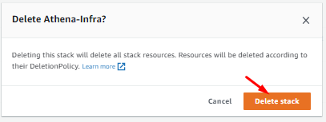

# AWS_Athena_Glue_S3_CloudFormation_Deployment_AWSConsole

## Description
AWS Athena, Glue Database, Glue Crawler and S3 buckets deployment through CloudFormation stack on AWS console.

## Overview
This document provides detail on a CloudFormation template that can be deployed on your AWS environment. The template defines an IAM Role for Glue, two S3 buckets, Athena Workgroup, Glue Database, and a Glue Crawler which scans your S3 bucket and populates the Glue Database tables with the recordings metadata. Athena is used for querying the populated data.

## Step - 1
Open visual studio code and create a YAML file with any specific name and paste the CloudFormation stack code into that file and save.

```yaml
# Sample CF YAML to demonstrate creating S3 buckets with Glue Database.
AWSTemplateFormatVersion: '2010-09-09'

# Parameters section contains name of the resource for your environment like staging, testing, production.
Parameters:
  Env:
    Type: String

# Resources section defines metadata for the Resources.
# Create IAM Role assumed by the crawler. For demonstration, this role is given all permissions.
Resources:
   AWSAthenaGlueRole:
     Type: AWS::IAM::Role
     Properties:
       AssumeRolePolicyDocument:
         Version: "2012-10-17"
         Statement:
           - Effect: "Allow"
             Principal:
               Service:
                 - "glue.amazonaws.com"
             Action:
               - "sts:AssumeRole"
       Path: "/"
       Policies:
         - PolicyName: AWSAthenaAccess
           PolicyDocument:
             Statement:
               - Effect: Allow
                 Action: athena:*
                 Resource: '*'
         - PolicyName: GlueS3Access
           PolicyDocument:
             Statement:
               - Effect: Allow
                 Action:
                   - glue:*
                   - iam:ListRolePolicies
                   - iam:GetRole
                   - iam:GetRolePolicy
                 Resource: '*'
               - Effect: Allow
                 Action:
                   - s3:*
                   - s3-object-lambda:*
                 Resource: '*'
               - Effect: Allow
                 Action:
                   - s3:GetObject
                   - s3:PutObject
                 Resource:
                   - arn:aws:s3:::aws-glue-*/*
                   - arn:aws:s3:::*/*aws-glue-*/*
                   - arn:aws:s3:::aws-glue-*
           PolicyName: AWSCloudWatchLogsAccess
           PolicyDocument:
             Statement:
               - Effect: Allow
                 Action:
                   - logs:CreateLogGroup
                   - logs:CreateLogStream
                   - logs:GetLogEvents
                   - logs:PutlogEvents
                 Resource:
                   - arn:aws:logs:*:*:/aws-glue/*

# Create a S3 bucket for raw data.
  RawDataBucket:
    Type: AWS::S3::Bucket
    Properties: 
      BucketName: !Sub raw-data-${AWS::AccountId}-${AWS::Region}-${Env}
      BucketEncryption: 
          ServerSideEncryptionConfiguration: 
            - 
              ServerSideEncryptionByDefault: 
                  SSEAlgorithm: 'AES256'
              BucketKeyEnabled: false
      PublicAccessBlockConfiguration:
        BlockPublicAcls: true
        BlockPublicPolicy: true
        IgnorePublicAcls: true
        RestrictPublicBuckets: true

# Create a S3 bucket for query data backup.
  AthenaQueryResultBucket:
    Type: AWS::S3::Bucket
    Properties: 
      BucketName: !Sub query-result-${AWS::AccountId}-${AWS::Region}-${Env}
      BucketEncryption: 
          ServerSideEncryptionConfiguration: 
            - 
              ServerSideEncryptionByDefault: 
                  SSEAlgorithm: 'AES256'
              BucketKeyEnabled: false
      PublicAccessBlockConfiguration:
        BlockPublicAcls: true
        BlockPublicPolicy: true
        IgnorePublicAcls: true
        RestrictPublicBuckets: true
      LifecycleConfiguration: 
        Rules: 
          - 
            Id: 'auto-delete'
            Status: 'Enabled'
            ExpirationInDays: 7

# Create athena workgroup for query.
  AWSAthenaWorkGroup:
    Type: AWS::Athena::WorkGroup
    Properties:
      Name: !Sub athena-work-group-${Env}
      Description: !Sub athena-work-group-${Env}
      State: ENABLED
      RecursiveDeleteOption: true
      WorkGroupConfiguration:
        EnforceWorkGroupConfiguration: true
        PublishCloudWatchMetricsEnabled: true
        RequesterPaysEnabled: false        
        ResultConfiguration:
          OutputLocation: !Sub s3://${AthenaQueryResultBucket}/data
          EncryptionConfiguration: 
            EncryptionOption: 'SSE_S3'
        
# Create a database to contain tables created by the crawler.
  AWSGlueDatabase:
    Type: AWS::Glue::Database
    Properties: 
      CatalogId: !Ref AWS::AccountId  
      DatabaseInput:
        Name: !Sub glue-database-${Env}

# Create a crawler to crawl the data on a Raw Data S3 bucket
  AWSGlueCrawler:
    DependsOn:
      - AWSAthenaGlueRole
      - AWSGlueDatabase
    Type: AWS::Glue::Crawler
    Properties:
      Name: !Sub glue-crawler-${Env}
      Description: AWS Glue crawler to crawl data
      Role: !GetAtt AWSAthenaGlueRole.Arn
      #Schedule: none, use default run-on-demand
      Schedule:
        # Run crawler every day every 6 hours Monday to Friday
        ScheduleExpression: 'cron(0 0/6 ? * MON-FRI *)'
      DatabaseName: !Ref AWSGlueDatabase
      Targets:
        S3Targets:
          # Raw Data S3 bucket with the data
          - Path: !Ref RawDataBucket
            Exclusions:
              - "**.wav"
              - "**.webm"
              - "**.zip"
              - "**.opus"
              - "**.txt"
      TablePrefix: !Sub glue-table-${Env}
      SchemaChangePolicy:
        UpdateBehavior: "UPDATE_IN_DATABASE"
        DeleteBehavior: "LOG"
      Configuration: "{\"Version\":1.0,\"CrawlerOutput\":{\"Partitions\":{\"AddOrUpdateBehavior\":\"InheritFromTable\"},\"Tables\":{\"AddOrUpdateBehavior\":\"MergeNewColumns\"}}}"

# Create log group for glue crawler.
  AWSGlueCrawlerLogGroup:
    Type: AWS::Logs::LogGroup
    Properties:
      LogGroupName: /aws-glue/crawlers
#      RetentionInDays: 1
       
# Show out put results after completon of Cloud Formation Stack.
Outputs:
  AWSAthenaGlueRole:
    Value: !Ref AWSAthenaGlueRole
    Export:
      Name: !Sub "${Env}-AWSAthenaGlueRole-Name"
  RawDataBucket:
    Value: !Ref RawDataBucket
    Export:
      Name: !Sub "${Env}-RawDataBucket-Name"
  AthenaQueryResultBucket:
    Value: !Ref RawDataBucket
    Export:
      Name: !Sub "${Env}-AthenaQueryResultBucket-Name"
  AWSAthenaWorkGroup:
    Value: !Ref AWSAthenaWorkGroup
    Export:
      Name: !Sub "${Env}-AWSAthenaWorkGroup-Name"
  AWSGlueDatabase:
    Value: !Ref AWSGlueDatabase
    Export:
      Name: !Sub "${Env}-AWSGlueDatabase-Name"
  AWSGlueCrawler:
    Value: !Ref AWSGlueCrawler
    Export:
      Name: !Sub "${Env}-AWSGlueCrawler-Name"
```
Note: Make sure your indentations are correct in yaml file.

By using different parameters, you should be able to create multiple environments with `{Env}` like Stagging, Testing, and Production.

You can also change the S3 buckets resource names as you required in fields like `RawDataBucket:` `AthenaQueryResultBucket:`

You can also specify the S3 buckets names as you required like in the field.
`BucketName: !Sub required-name-${AWS::AccountId}-${AWS::Region}-${Env}`

The same way you can change the resources name as you required with their specific Name fields as required.

## Step - 2
Login to your AWS account and go to the CloudFormation console and select the nearest working region in which you want to deploy your infrastructure stack.

You can also deploy your stack through AWS CLI command

`aws cloudformation create-stack --stack-name Athena-infrastructure --template-body file://./file-name.yml`

And from AWS console


Click on the "Create stack" button, select "Template is ready".
In the "Specify template" panel, select the "Upload a template file", and "Choose file" buttons to select your file, and click the "Next" button


Provide the “Stack name” and as you can see Parameters are already defined which we provided through YAML file, click the “Next” button


Rest of all leave as default and click “Next”


Review the things, acknowledge and click the “Submit” button.


After successfully deploying, you can check the resources created by the stack.


Also, you can check the output with export names.


## Step - 3
Now go to AWS Glue console, on left side panel click on “Crawlers”


Select the created crawler and click the “Run” button. The crawler will take some time to complete and create a metadata table.


When you click on the crawler that takes you to its detail page.

## Step - 3
On another side, you can check the crawler logs and table by going through the CloudWatch logs console and Glue console, Tables.


For Tables in AWS Glue


## Step - 4
Now finally go to AWS Athena console, select query editor, and from the left top drop-down menu select your workgroup where you can see your database and table details.


In the Saved query you can check if your query is there which you deployed through CloudFormation. Run the saved query to get your results.


After successful completion, your query results are saved in your S3 bucket output path.


## Step - 5
Finally, you can clean the whole stack by deleting the CloudFormation stack to avoid any extra charges but for CloudWatch and S3 buckets you have to manually delete the data.


